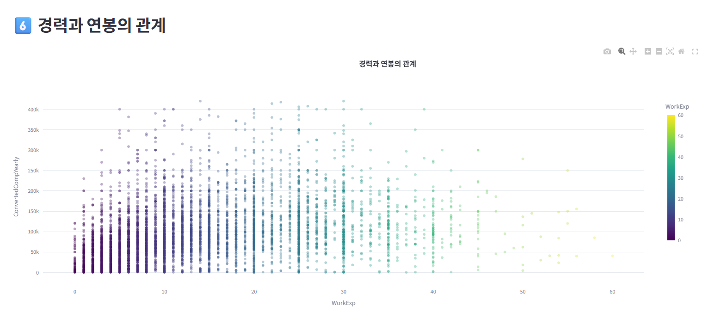
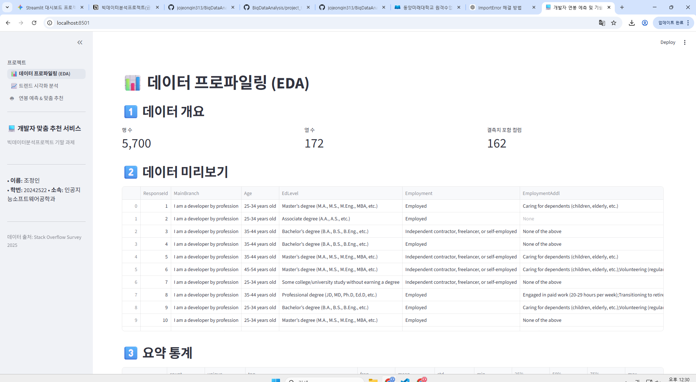

# [기말 프로젝트 최종 보고서] Stack Overflow 2025 기반 개발자 연봉 예측 및 맞춤 기술 로드맵 추천 서비스

* **소속:** 동양미래대학교 인공지능소프트웨어공학과
* **학번:** 20242522
* **이름:** 조정인

---

# 1. 프로젝트 개요 및 문제 정의

## 1.1 배경 및 필요성

* **분석 데이터:** Stack Overflow Developer Survey 2025
* **데이터 출처:** Kaggle (Open Database License)
* **데이터 규모:** 전 세계 개발자 설문 데이터, 100개 이상의 컬럼 포함

최근 인공지능 기술의 발전과 함께 개발자에게 요구되는 기술 스택이 빠르게 변화하고 있다. 하지만 취업을 준비하는 학생들은 희망 직무별로 어떤 기술을 우선적으로 학습해야 하는지, 해당 직무의 시장 가치(연봉)는 어느 정도인지 객관적인 정보를 얻기 어렵다.

이에 본 프로젝트는 실제 글로벌 개발자 설문 데이터를 활용하여 직무별 기술 트렌드와 연봉 현황을 분석하고, 사용자의 조건에 따른 맞춤형 기술 로드맵을 제공하는 서비스를 구현하는 것을 목표로 한다.

---

## 1.2 해결하고자 하는 문제

### 기술 방향성 부족

취업 준비생들은 Backend Developer, Data Engineer, AI/ML Engineer 등 희망 직무별로 어떤 기술을 우선적으로 학습해야 하는지 판단하기 어렵다.

### 연봉 정보 부족

경력과 국가에 따른 실제 개발자 연봉 수준을 확인하기 어렵다.

### AI 활용 트렌드 파악 어려움

실무 개발자들이 AI 도구를 얼마나 활용하는지 객관적인 통계 자료가 부족하다.

### 해결 방안

Stack Overflow 2025 데이터를 분석하여

* 개발자 기술 스택 현황 분석
* 직무별 평균 연봉 분석
* 경력별 연봉 분석
* AI 활용 현황 분석

을 수행하고, 이를 바탕으로 사용자의 조건에 맞는 연봉 예측 및 맞춤형 기술·자격증 추천 서비스를 제공한다.

---

# 2. 데이터 프로파일링 및 전처리 (EDA)

## 2.1 데이터 구조 및 주요 컬럼

본 프로젝트에서는 전체 설문 데이터 중 분석 목적에 필요한 핵심 컬럼만 선별하여 활용하였다.

| 분류       | 컬럼명                    | 설명          |
| -------- | ---------------------- | ----------- |
| 직무 정보    | DevType                | 개발자 직무      |
| 국가 정보    | Country                | 거주 국가       |
| 경력 정보    | WorkExp                | 실무 경력       |
| 프로그래밍 언어 | LanguageHaveWorkedWith | 사용 언어       |
| AI 활용    | AISelect               | AI 도구 활용 여부 |
| 연봉       | ConvertedCompYearly    | 연간 보상(USD)  |

---

## 2.2 데이터 전처리

분석 정확도를 높이기 위해 다음과 같은 전처리를 수행하였다.

### 결측치 제거

분석에 반드시 필요한 컬럼인

* DevType
* Country
* ConvertedCompYearly

의 결측값을 제거하였다.

### 경력 데이터 정제

WorkExp 컬럼을 숫자형으로 변환하고 결측값은 0으로 처리하였다.

### 연봉 데이터 정제

ConvertedCompYearly 컬럼을 숫자형으로 변환한 후 상위 1%와 하위 1%의 극단값을 제거하여 이상치의 영향을 줄였다.

### 데이터 샘플링

시각화 성능 향상을 위해 필요 시 일부 데이터만 사용하였다.

---

# 3. 핵심 데이터 시각화 및 인사이트

본 프로젝트에서는 Plotly 기반 인터랙티브 시각화를 활용하여 개발자 시장의 주요 특징을 분석하였다.

## 3.1 개발자 언어 TOP10

가장 많이 사용되는 프로그래밍 언어를 분석하였다.

### 인사이트

* Python
* JavaScript
* SQL

등이 높은 사용 빈도를 보였다.

이는 데이터 분석, 웹 개발, 인공지능 분야에서 공통적으로 활용되는 핵심 기술임을 의미한다.

---

## 3.2 직무별 평균 연봉

직무에 따른 평균 연봉을 비교하였다.

### 인사이트

Data Engineer 및 AI/ML Engineer 직무가 상대적으로 높은 평균 연봉을 보이는 경향이 나타났다.

이는 데이터 및 인공지능 분야에 대한 높은 수요가 반영된 결과로 해석할 수 있다.

---

## 3.3 경력별 평균 연봉

경력 증가에 따른 평균 연봉 변화를 분석하였다.

### 인사이트

경력이 증가할수록 평균 연봉 역시 증가하는 경향을 확인하였다.

실무 경험이 개발자의 시장 가치에 중요한 영향을 미친다는 점을 확인할 수 있었다.

---

## 3.4 국가별 평균 연봉 TOP10

국가별 개발자 평균 연봉을 비교하였다.

### 인사이트

국가별 평균 연봉 차이가 크게 나타났으며, 국가별 산업 구조와 IT 시장 규모가 보상 수준에 영향을 미치는 것으로 분석되었다.

---

## 3.5 AI 활용 현황

개발자의 AI 활용 여부를 시각화하였다.

### 인사이트

많은 개발자들이 업무 과정에서 AI 기반 도구를 활용하고 있는 것으로 나타났다.

이는 생성형 AI 기술이 실제 개발 환경에 빠르게 확산되고 있음을 보여준다.

---

# 4. 맞춤형 추천 서비스 구현

## 4.1 서비스 개요

본 프로젝트는 사용자가 입력한 정보를 기반으로 예상 연봉과 맞춤형 기술 로드맵을 제공하는 웹 서비스를 구현하였다.

---

## 4.2 입력 정보

사용자는 다음 정보를 입력한다.

* 희망 직무
* 개발 경력
* 근무 국가
* AI 활용 여부

---

## 4.3 출력 결과

시스템은 다음 결과를 제공한다.

### 예상 연봉

사용자의 경력과 직무를 기반으로 예상 연봉을 계산하여 제공한다.

### 추천 기술 스택

직무별로 필요한 핵심 기술을 추천한다.

예시)

* Backend Developer → Java, Spring Boot, SQL, AWS
* Data Engineer → Python, SQL, Spark, Airflow
* AI/ML Engineer → Python, TensorFlow, PyTorch

### 추천 자격증

직무별 추천 자격증을 제공한다.

예시)

* SQLD
* ADsP
* AWS Certified Data Engineer
* TensorFlow Developer Certificate

### 커리어 로드맵

학습 우선순위와 성장 방향을 함께 제시한다.

---

# 5. 구현 환경

| 항목     | 사용 기술                      |
| ------ | -------------------------- |
| 언어     | Python                     |
| 데이터 처리 | Pandas, NumPy              |
| 시각화    | Plotly                     |
| 웹 서비스  | Streamlit                  |
| 데이터셋   | Stack Overflow Survey 2025 |

---

# 6. 결론 및 향후 과제

## 6.1 프로젝트 결과

본 프로젝트는 글로벌 개발자 설문 데이터를 활용하여 개발자 직무, 기술 스택, 경력, 연봉 간의 관계를 분석하였다.

또한 Streamlit 기반 대시보드를 구축하여 사용자가 직접 조건을 입력하고 예상 연봉, 추천 기술 스택, 추천 자격증 정보를 확인할 수 있는 맞춤형 서비스를 구현하였다.

이를 통해 취업 준비생이 데이터 기반으로 진로를 탐색하고 학습 방향을 설정할 수 있도록 지원하였다.

---

## 6.2 한계점 및 향후 과제

### 한계점

* Stack Overflow 설문 응답자의 지역 분포가 특정 국가에 집중되어 있다.
* 실제 채용 공고 데이터가 아닌 설문 데이터 기반 분석이라는 한계가 존재한다.
* 연봉 예측은 규칙 기반으로 구현되어 실제 시장 상황을 완벽히 반영하지 못한다.

### 향후 과제

* 국내 채용 플랫폼 데이터 연계
* 실제 머신러닝 회귀 모델 적용
* 직무 추천 기능 추가
* 기술 스택 학습 경로 자동 생성 기능 구현

향후 국내 채용 플랫폼 데이터와 결합한다면 보다 정확한 맞춤형 진로 추천 서비스로 발전시킬 수 있을 것으로 기대된다.
